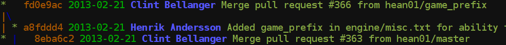

Who am I
--------
Hey, that's me!
```bash
[user]
	name = Chris Oelmueller
	email = chris.oelmueller@gmail.com
```

Core
----
TODO
```bash
[core]
	repositoryformatversion = 0
	filemode = true
	bare = false
	logallrefupdates = true
	whitespace = fix,-indent-with-non-tab,trailing-space,cr-at-eol
```

Inline Diff
-----------
Admittedly the name of this is, like, *really* confusing and *totally*
misleading. I scraped it off the internets a while ago and never thought
about its name much afterwards, but come to reconsider now.
Anyways, what it does is awesome and best explained by a picture I have
yet to create and upload. TODO!
```bash
[pager]
	diff = ~/.git/inline-diff.pl | less
	show = ~/.git/inline-diff.pl | less
```

Push
----
This will be the default in Git 2.0 but I want it right now. Does not push
all branches when `git push` is executed without remote and branch arguments.
Instead, attempts to push the current branch to its remote. Manpage:
> This is the safest option and is well-suited for beginners.

```bash
[push]
	default = simple
```

Colors
------
Working with git can be hard at times since the information density
found in some parts of its output can be pretty high. Colored output
greatly helps you understand and comprehend more stuff in less time.

First, enable colored output when writing to a terminal:
```bash
[color]
	ui = auto
```

There are some tweaks i use to further enhance legibility of certain
commands. Keep in mind that, as with everything, this highly depends
on several factors and so you probably do not agree with some of them.

In particular, my `git diff` output uses a red / blue color pair for
removed / added lines instead of the canonic red / green representation.
As we learned during FOSDEM 2013, the most downloaded [Jenkins] plugin
has the sole purpose of switching their default *blue* status light for
passing tests to a *green* one.
Apparently people are different, and you are of course welcome to change
any of these colors to something that you feel more comfortable working
with!

Available colors:
  `normal, black, red, green, yellow, blue, magenta, cyan, white`.
After the foreground color, you can optionally list a background color
and one of
  `bold, dim, ul, blink, reverse`.

What you will also notice in my [.vimrc](../vimrc/vimrc.md) is a slight
obsession over trailing whitespace, so naturally i want my diffs to show
such *bad* whitespace. `red reverse` does a great job at that.
If you want to check what kind of whitespace we defined as *bad*, the
very first section `[core]` of this configuration file tells you.

```bash
[color "diff"]
	meta = bold
	frag = magenta bold
	old = red bold
	new = blue bold
	whitespace = red reverse
[color "status"]
	added = blue bold
	changed = blue reverse
	untracked = blue dim
[color "branch"]
	current = yellow reverse
	local = yellow
	remote = green
```

Custom diff and merge rules
---------------------------
When working on larger projects, you inevitably find yourself in a
situation where the only way out is a custom file format that does
just what you need. Obviously that is great for your project, assuming
you're not nuts when deciding this, but your favorite version control
suite may not know how to handle this particular file format yet.

Above situation is what the `"des"` section deals with. It's used in
[DCSS] to define custom, community-designed parts of a level. To
translate its internal structure to something `git diff` can work with,
we teach git about some basic elements that could be understood as
abstract concept of a "function name", even if the file format has no
notion of functions.

Similarly, `git` was written with source code in mind. Merging binary
data is a pretty hard task and more often impossible than feasible.
For the cases where you're lucky (like with `sqlite` databases below,
used in [Unknown Horizons]) and merging at least might make sense
theoretically, you can define any tool for that task. Git will choose
based on file extensions. The `sqlite3dump` script in question can be
checked here: [sqlite3dump]
```bash
[diff "sql"] 
	textconv = strings
[merge "sql"] 
	textconv = strings
[diff "sqlite"] 
	textconv = sqlite3dump
[merge "sqlite"] 
	textconv = sqlite3dump
# For crawl, specifically:
[diff "des"]
	xfuncname = ".*\\{\\{.*"
	xfuncname = "^NAME:.*$"
```

Aliases
-------
Probably the most important section around here.

I'm going to discuss the more advanced aliases one-by-one to provide
more information. Keep in mind that all of them go in the `[alias]`
section however.

Let's start with some simple renames and abbreviations.
```bash
[alias]
	c  = commit
	o  = checkout
	ack = grep
	cp = cherry-pick
	pm = push origin master
```
[Ack.](http://betterthangrep.com/)

Commands remapped to include certain flags:
```bash
	diff = diff --minimal
	# Often patches fail to apply because the three-way merge is
	# disabled by default. It really should not be in my opinion.
	am = am --3way
```

Some more abbreviated commands. The lines starting with `!` execute
anything on this line in your favorite shell, which is used here to
access previously defined aliases instead of copy-pasting code:
```bash
	ca = commit --am
	cx = ! git ca --reset-author
	dc = ! git diff --cached
	lof = log --follow -p

	ffp = format-patch --minimal --keep-subject --find-renames --break-rewrites
	# For when you don't need generated patch files, which is always:
	fp = ! git ffp --stdout
```
- `git fp`: Some of the options i like to use when assembling format-patches
- `git lof`: Show me what happed when and who did it. Much more elaborate
  than `git blame` in that it actually allows you to track down history.
  Note that for huge files, following history may have a bit of impact
  if you are not blessed with an SSD.

Those are all the basic abbreviations i need in my workflow. I will admit
that anything beyond is really relying on tab completion for git commands
(which you should set up **right now** if you are not using it already).
You might notice how most of my aliases are named carefully as to not
interfere with tab completion

Now on to the *special* functions that are pretty awesome:

#### git lg


Use like `git log` except that this actually is helping you understand
history of a repository. If you intend to share the output, you may want
to consider using the color-stripped version `git lp` instead.
```bash
	lg = log --graph --date=short --pretty=format:'%C(yellow)%h %C(green)%ad %C(bold blue)%an%C(red)%d %C(reset)%s'
	# lg without custom colors but [author] brackets (for pastebin purposes):
	lp = log --graph --date=short --pretty=format:'%h %ad [%an]%d %s'
```
Inspired by [1] (http://www.jukie.net/bart/blog/pimping-out-git-log)
and [2] (http://durdn.com/blog/2012/11/22/must-have-git-aliases-advanced-examples/).

The example output above is related to [Flare], which you really should
check out when you have some spare time! A larger `git lg` sample
output of the same repository can be found [here](git-lg-large.png).

#### git sed
Usage: `git sed 's@foo@bar@g' horizons/gui/`
```bash
	sed = ! "f() { git grep -I --null --full-name --name-only . $2 | xargs -0 sed -i -e $1; }; f"
```
Inspired by stackoverflow.

#### git pr
A somewhat external alias to manage pull requests from the command line.
Adding `hub` to `git` results in `git + hub = github`, and the pull request
part is especially nice because it allows you to attach pull requests to
existing issues, which to my knowledge is not possible through their website.

An example attaching the current branch of your current repository to issue
`#27` could look like this:
  `git pr -i 27`.
Add `-b NotMe:master` if you are not an owner of the remote repository,
but `NotMe` is and granted you push access.
```bash
	pr = ! hub pull-request
```
More about [hub] here. As always, make sure to not overdo this --
converting issues to pull requests cannot be undone!

This concludes the rather huge section on aliases. But, of course, why
stop here if we can have yet another kind of cool alias functionality?

Remote Aliases
--------------
Because typing is horrible, and so is copying text from github repository
overview pages, we should drop most of the work and focus on the more
important things instead.

Instead of cloning lots of repositories like
  `git clone git@github.com:fifengine/python-tutorials.git`
(and hating yourself whenever an organization is renamed), try this:
  [`git clone f:python-tutorials.git`]
  (https://github.com/fifengine/python-tutorials)

```bash
[url "git@github.com:"]
	insteadOf = g:
[url "git@github.com:ChrisOelmueller/"]
	insteadOf = gh:
[url "git@github.com:unknown-horizons/"]
	insteadOf = uh:
[url "git@github.com:fifengine/"]
	insteadOf = f:
[url "git@github.com:lpc/"]
	insteadOf = lpc:
```

[DCSS]: https://crawl.develz.org
[Flare]: http://flarerpg.org
[Unknown Horizons]: http://www.unknown-horizons.org
[Jenkins]: http://jenkins-ci.org
[hub]: http://defunkt.io/hub/hub.1.html
[sqlite3dump]: https://github.com/unknown-horizons/unknown-horizons/blob/master/development/sqlite3dump
